# 🧑‍💼 MyAskIT Agent: Using Prebuilt Agents and Tools

## Objective

The **IBM watsonx Orchestrate catalog** serves as a vast repository of prebuilt AI agents and tools, tailored to address a wide array of use cases and requirements. This extensive collection helps you discover agents, tools, or a blend of both that align with your specific needs. In this lab, we will use one of the prebuilt agents to demonstrate how easy it is for a user to start the agent-building journey.

Each watsonx Orchestrate prebuilt agent and tool is connected to a service. Services require connections to be established. For this lab, we have already created the necessary connections.

### Key features of prebuilt agents include:
- **Pre-configured**: Prebuilt agents come with pre-defined settings and configurations for easy setup.
- **Reusable**: Prebuilt agents can be used across multiple workflows, reducing the need to recreate similar tasks.  
- **Task-specific**: Each prebuilt agent is designed to perform a specific task or set of tasks, such as data processing, API calls, or notifications.  

In this lab, we will be creating an agent from scratch and utilizing prebuilt tools readily available in the catalog that are connected to ServiceNow.


## Building MyAskIT Agent

1. Click on hamburger menu, then **Build -> Agent Builder**

    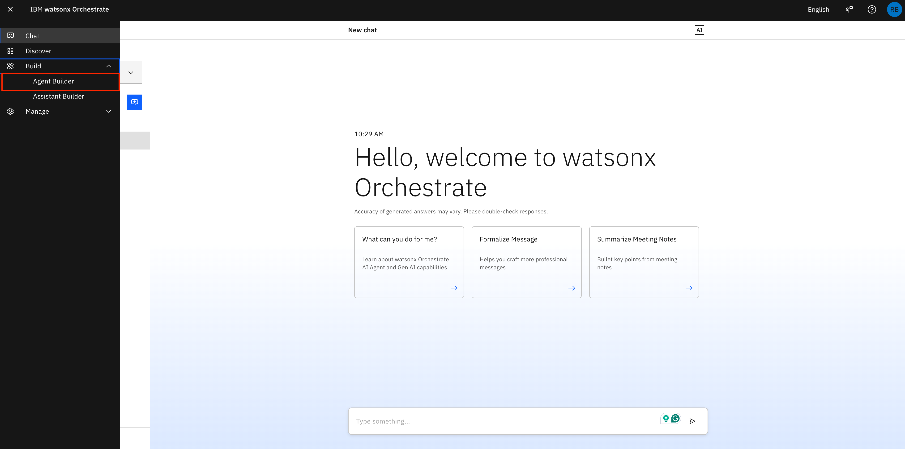

2. On the next screen, click on **Create Agent**

    

3. Follow the steps according to the screenshot below
    - Select **Create from scratch**
    - Name the agent: ```[Your_Initial]_MyAskIT```
    - Add the following to **Description**
    
      ```
      This agent helps a user create, delete or find incidents in ServiceNow.
      ```

4. Click **Create**

    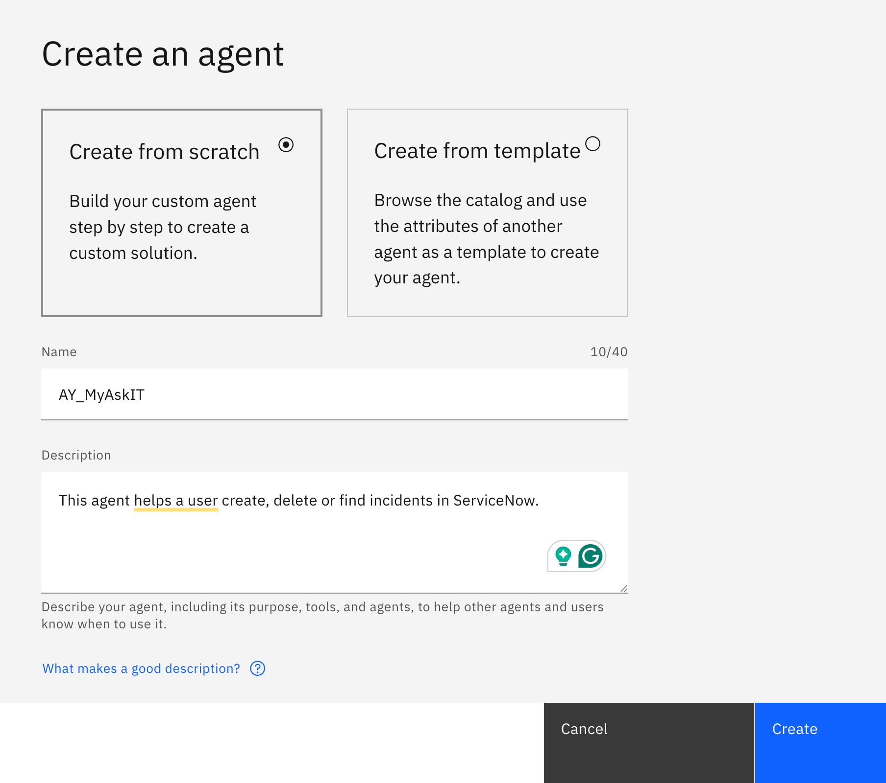

5. Once created, you would land in the agent building page.
    
    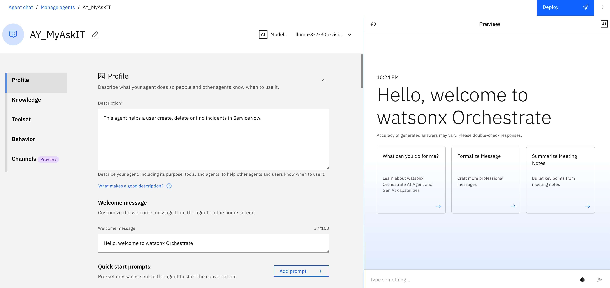
  
6. Let's customize this agent. Under **Welcome message**, add the following message:
   - Hello, welcome to MyAskIT
   
   Then add the following starter prompts:
   - Create an IT incident
   - Get an IT incident
   - Delete an IT incident

   Then click refresh button on the chat preview to see the changes.

   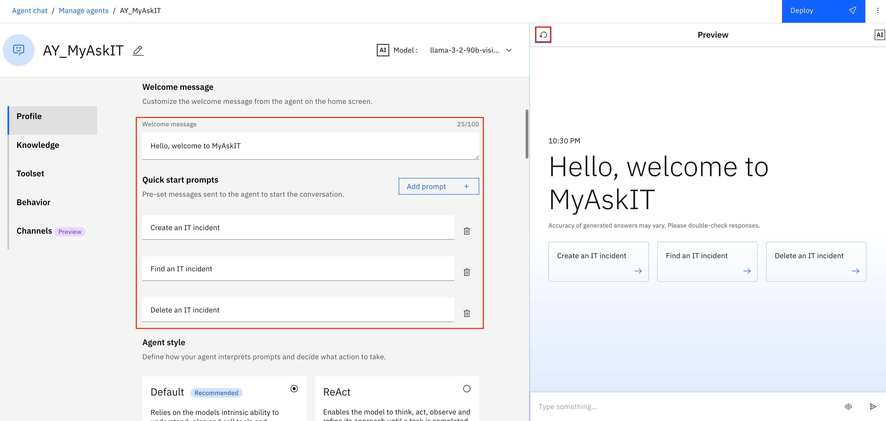

7. Let's now add our prebuilt tools. Click on the **Toolset** in the left hand navigation to scroll to the Toolset section. Then, click on the **Add tool** button.
    
    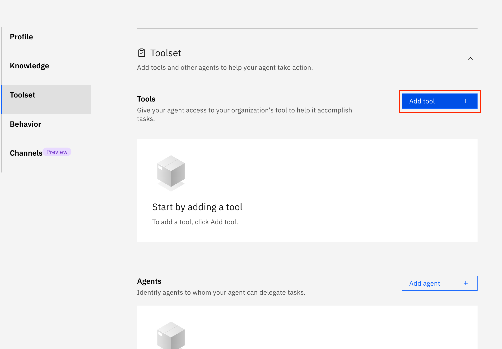

8. Click on **Add from catalog**.
    
    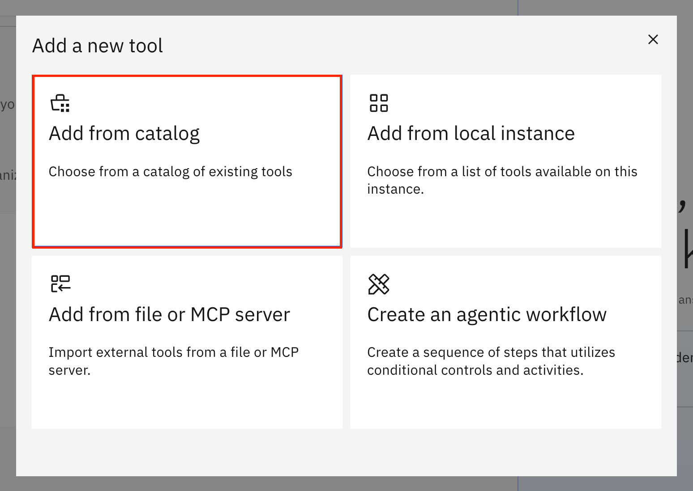

9. Search for `Create incident` and select the `Create an incident in ServiceNow tool`.
    
    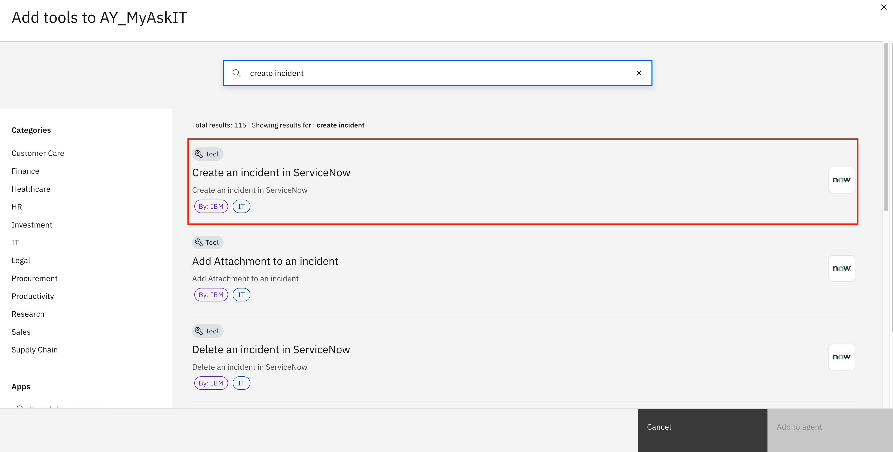

10. You will see the overview description of the tool. Click `Add to agent`. 

    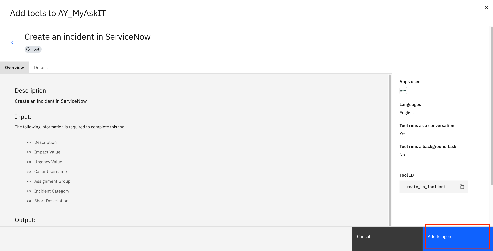

11. Repeat the steps to add 2 more prebuilt tools:
  - `Get incidents`
  - `Delete incidents`

    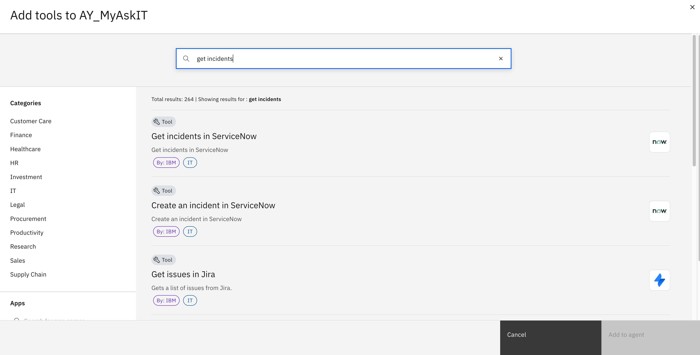
    

12. Once you have added all the tools, you should see the following under **Tools**.
    
    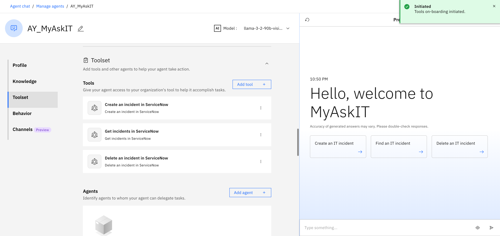

13. Click on the **Behaviour** in the left hand navigation to scroll to the Behaviour section. Add the following text to the **Instructions**:

    ```
    1. Use the "Create an incident in ServiceNow" tool to create an incident, with "short_description" based on user's reported description, "impact_value" set to 2 and "urgency_value" set to 3.
    2. Once incident has been created, respond to user with "incident_number" from the output of create_an_incident tool.
    3. Use the "Find incidents in ServiceNow" tool to find an incident, using "search" based user's indicated incident number, "limit" set to 1 and "skip" set to 0. Once found, return the "short_description" of the incident.
    4. Use the "Delete an incident in ServiceNow" tool to delete an incident, with "incident_number_system_id" based on the user's indicated incident number. Confirm with user before proceeding.
    ```

    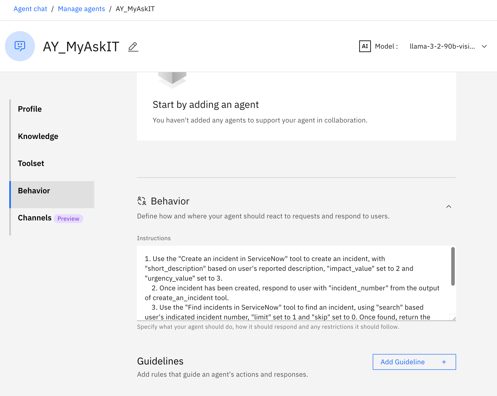

14. Now, let's deploy the agent by clicking on “Deploy” on the top right corner.

    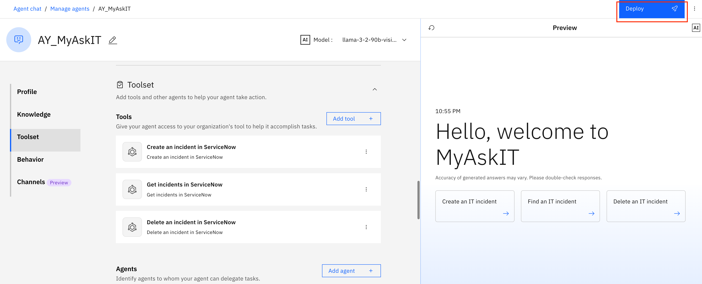

15. Once the deployment is ready, navigate to “Chat” from the left hand hamburger menu.

16. Search for your MyAskIT agent from the drop down menu.  

   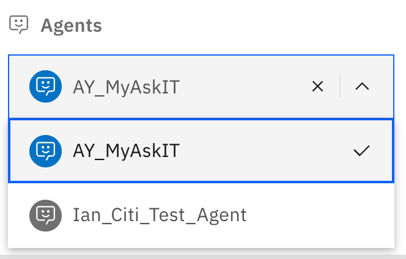

17. Try clicking the `Create an IT incident` tile on the chat window

18. Then try the following queries:
   ```
   find incident <your incident number>
   ```

   ```
   delete incident <your incident number>
   ```

   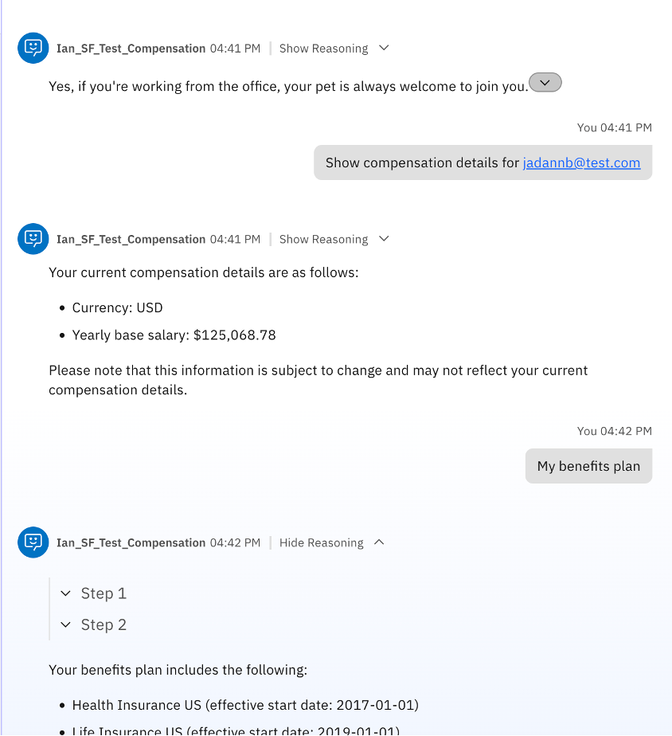

 
## **Conclusion**

The above practice is to demonstrate the ease to build custom agents using prebuilt tools and to edit the agents behaviour to work with the tools.
