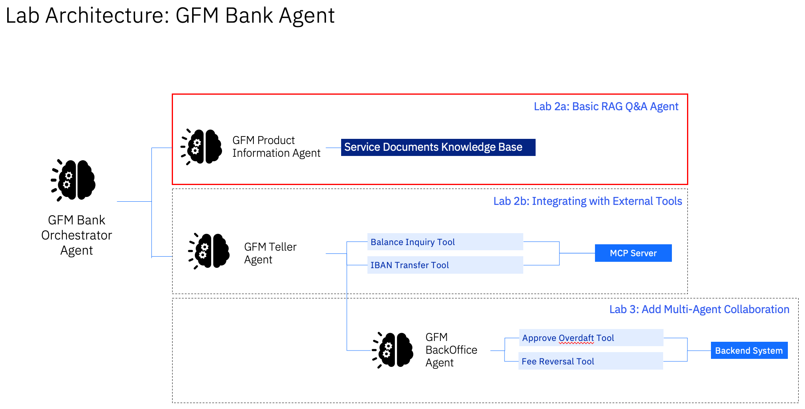
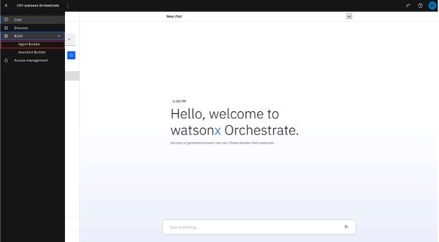
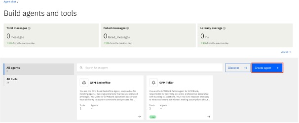
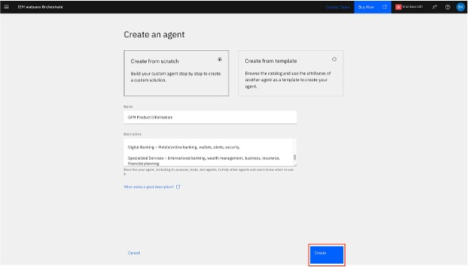

# 🏦 GFM Bank Lab 2a: Building low-code agent in Watsonx Orchestrate

## GFM Product Information RAG Agent

In this lab, we will be building the GFM Product Information Agent. This Agent acts as the trusted expert on all banking products and services pffered by GFM Bank. It helps customers explore and understand available financial solutions with clarity and precision.



### Create GFM Product Information RAG Agent

1. Click on hamburger menu, then **Build -> Agent Builder**

    

1. On the next screen, click on **Create Agent**

    

1. Follow the steps according to the screenshot below
    - Select **Create from scratch**
    - Name the agent: *GFM Product Information*
    - Add the following to **Description**
    ```
    You are the expert resource for all GFM Bank products and services. Provide accurate, clear, and helpful information while delivering an exceptional customer experience.

    You Expertise Covers:
    Account Products - Features, fees, interest rates, requirements.

    Lending Products - Terms, rates, eligibility for personal, home, auto, and credit builder loans.

    Card Services - Credit, debit, secured, business cards, overdraft protection.

    Digital Banking - Mobile/online banking, wallets, alerts, security.

    Sepcialized Services - International banking, wealth management, business, insurance, financial planning.
    ```

1. Click **Create**

    
