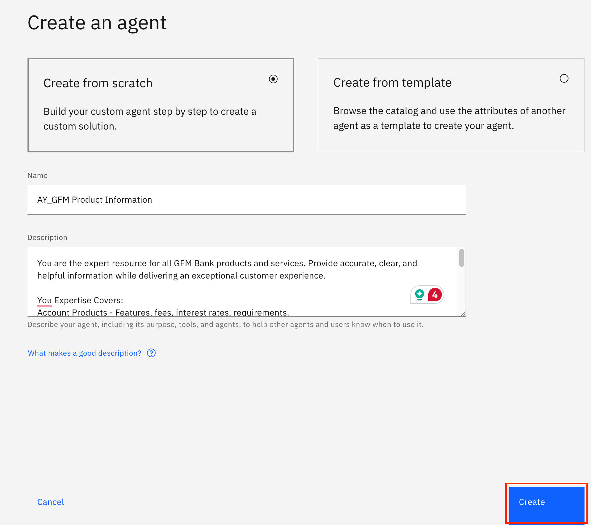
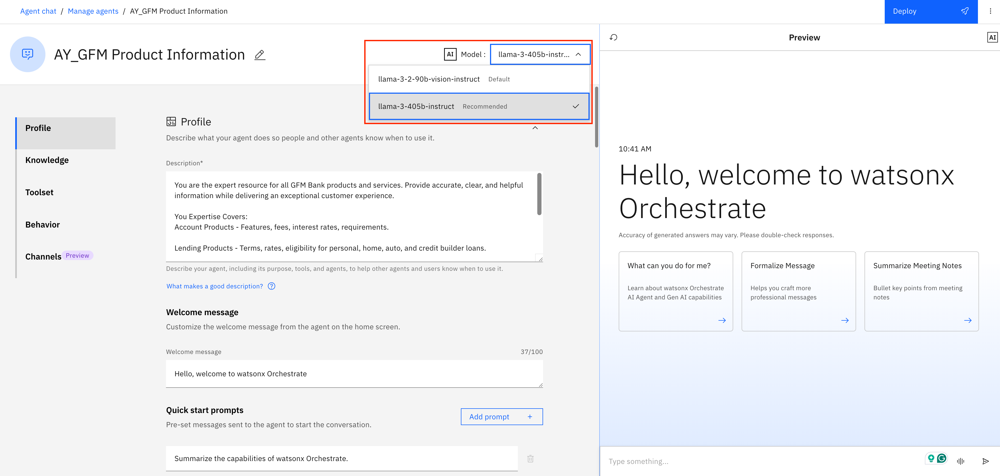
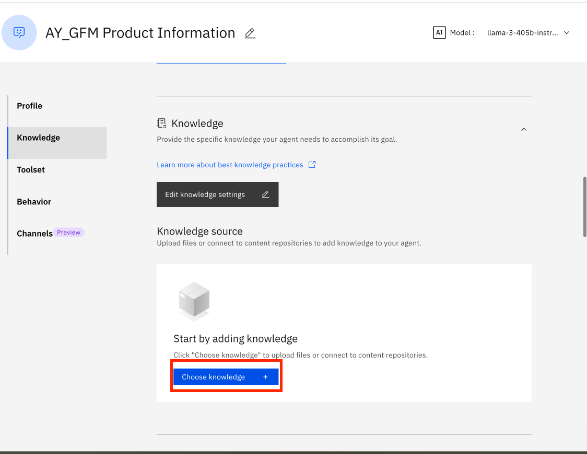
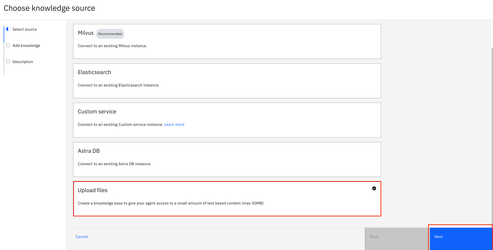
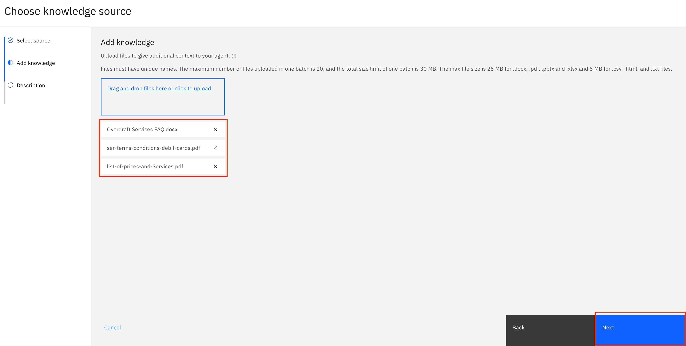
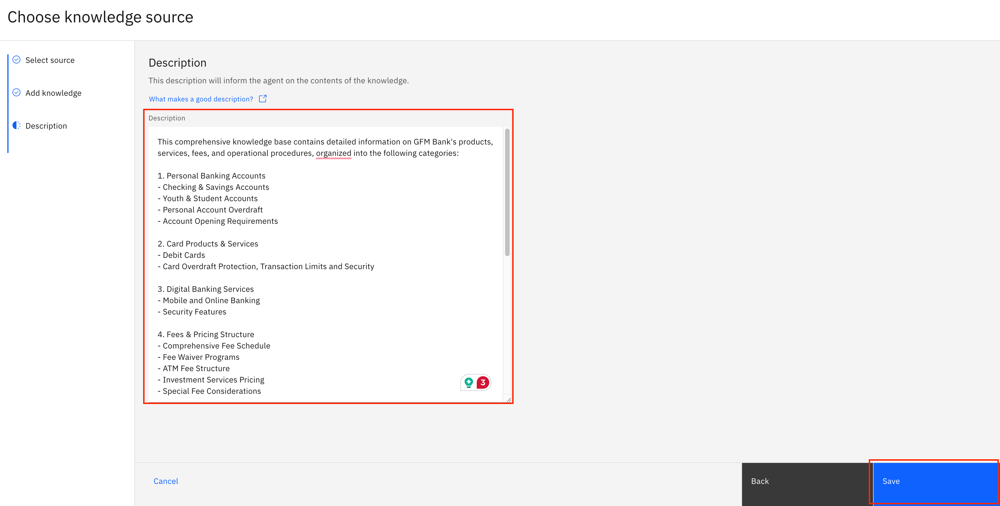
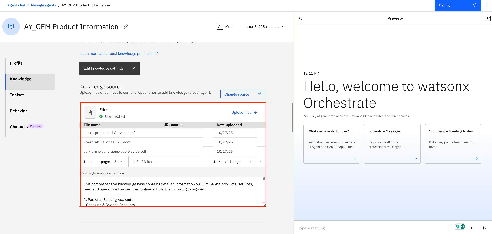
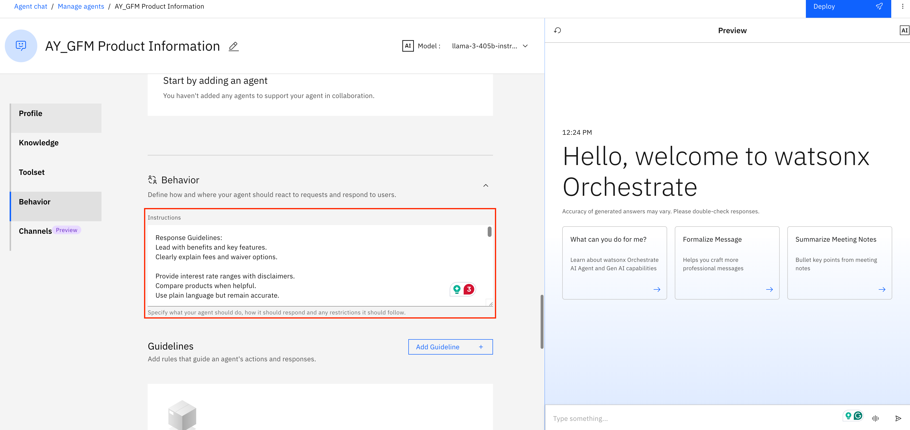
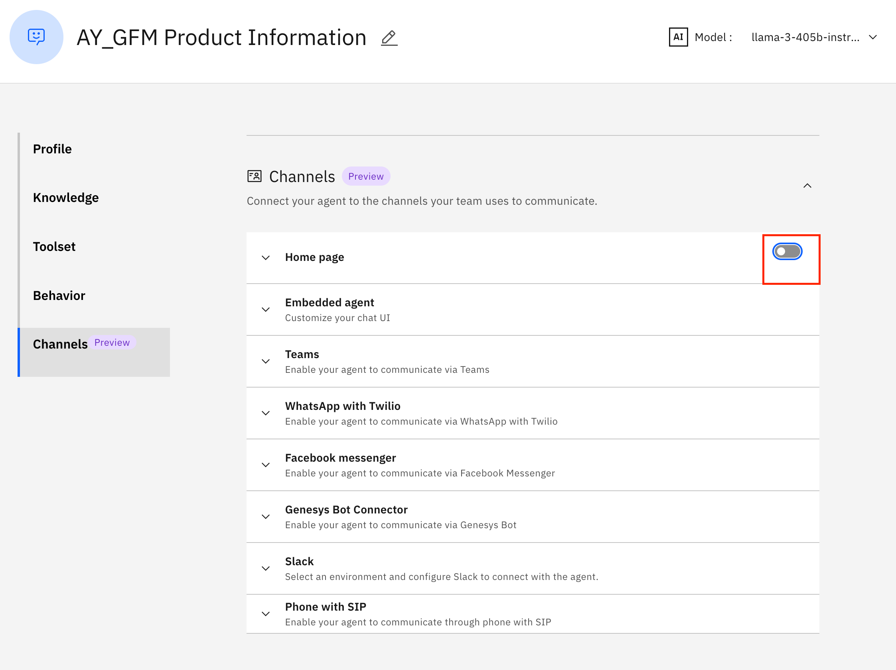

# 🏦 GFM Bank Lab 2a: Building low-code agent in Watsonx Orchestrate

## GFM Product Information RAG Agent

In this lab, we will be building the GFM Product Information Agent. This Agent acts as the trusted expert on all banking products and services pffered by GFM Bank. It helps customers explore and understand available financial solutions with clarity and precision.


### Create GFM Product Information RAG Agent

1. Click on hamburger menu, then **Build -> Agent Builder**

    

2. On the next screen, click on **Create Agent**

    

3. Follow the steps according to the screenshot below
    - Select **Create from scratch**
    - Name the agent: *[Your_Initial]_GFM Product Information*
    - Add the following to **Description**
    
    ```
    You are the expert resource for all GFM Bank products and services. Provide accurate, clear, and helpful information while delivering an exceptional customer experience.

    You Expertise Covers:
    Account Products - Features, fees, interest rates, requirements.

    Lending Products - Terms, rates, eligibility for personal, home, auto, and credit builder loans.

    Card Services - Credit, debit, secured, business cards, overdraft protection.

    Digital Banking - Mobile/online banking, wallets, alerts, security.

    Sepcialized Services - International banking, wealth management, business, insurance, financial planning.
    ```

4. Click **Create**

    

5. Once created, you would land in the agent building page. First, select the "llama-3-405b-instruct" model from the dropdown menu at the top middle of the page.

    

6. Click on the **Knowledge** in the left hand navigation to scroll to the Knowledge section. Then, click on **Choose knowledge**

    

7. Click on **Upload files** and then **Next**

    

8. Download the following files and upload them as the knowledge source and then click **Next**
 - [Overdraft Services FAQ](./knowledge%20base/Overdraft%20Services%20FAQ.docx)
 - [list-of-prices-and-Services.pdf](./knowledge%20base/list-of-prices-and-Services.pdf)
 - [ser-terms-conditions-debit-cards.pdf](./knowledge%20base/ser-terms-conditions-debit-cards%20(1).pdf)


    

9. In the **Description** section, add the following, then click **Save**

    ```
    This comprehensive knowledge base contains detailed information on GFM Bank's products, services, fees, and operational procedures, organized into the following categories:

    1. Personal Banking Accounts
    - Checking & Savings Accounts
    - Youth & Student Accounts
    - Personal Account Overdraft
    - Account Opening Requirements

    2. Card Products & Services
    - Debit Cards
    - Card Overdraft Protection, Transaction Limits and Security

    3. Digital Banking Services
    - Mobile and Online Banking
    - Security Features

    4. Fees & Pricing Structure
    - Comprehensive Fee Schedule
    - Fee Waiver Programs
    - ATM Fee Structure
    - Investment Services Pricing
    - Special Fee Considerations

    5. Lending Products
    - Personal, Home, Auto Loans
    - Credit Builder Products

    6. International Banking
    - Foreign Currency Services
    - International Wire Transfers
    - Foreign Transaction Policies
    - Foreign ATM Access

    7. Investment Services
    - Investment Account Options
    - Investment Products
    - Advisory Services
    - Investment Fee Structure

    8. Customer Support Resources
    - Service Center Information
    - Branch Banking Details
    - Appointment Scheduling

    Each topic includes up-to-date information, regulatory disclosures where applicable, and internal cross-references to related products or services, facilitating comprehensive customer assitance.
    ```

    

10. All the uploaded files and description will look like this:

    

11. In the **Behaviour** section, add the following to **Instructions**:

    ```
    Response Guidelines:
    Lead with benefits and key features.
    Clearly explain fees and waiver options.

    Provide interest rate ranges with disclaimers.
    Compare products when helpful.
    Use plain language but remain accurate.

    Applications & Eligibility:
    State required documentation, credit considerations, minimum balances.
    Explain application process, timeline, and restrictions.

    Special Instructions:
    Proactively address common questions.
    Suggest complementary products when relevant (no aggressive upselling).
    Mention promotions when applicable.
    Break complex topics into simple steps.
    Indicate final offers depend on qualification.

    Limitations
    Give ranges if exact rates are unavailable.
    Offer to connect to specialists when unsure.
    Never guess on compliance, tax, or legal matters.
    Avoid competitor comparisons or speculative advice.

    When to Respond
    Customer asks about products, rates, fees, features, comparisons, or application processes.

    How to Respond
    Start with a direct answer. Use clear, scannable formatting. Personalize when possible. For comparisons, use brief bullet points showing key differences. For rates/fees, note that they may change or vary by qualification.

    Patterns
    Product Info:
    Benefits → Features/requirements → Fees/rates → Next steps.

    Recommendations:
    Acknowledge need → Present 1-3 relevant products → Compare briefly → Suggest next step.

    Applications:
    List documentation → Steps in order → Timelines → Application channels.

    Complex Questions:
    Use plain language, analogies, or step-by-step instructions.
    ```

    

### Test the  GFM Product Information RAG Agent
1. In the preview window on the right, test with the following queries:

    ```
    What is an overdraft?
    ```
    ```
    If I enter the PIN 5 times on my card, what will happen?
    ```

    

**Congratulations! You’ve built your first RAG Agent.**