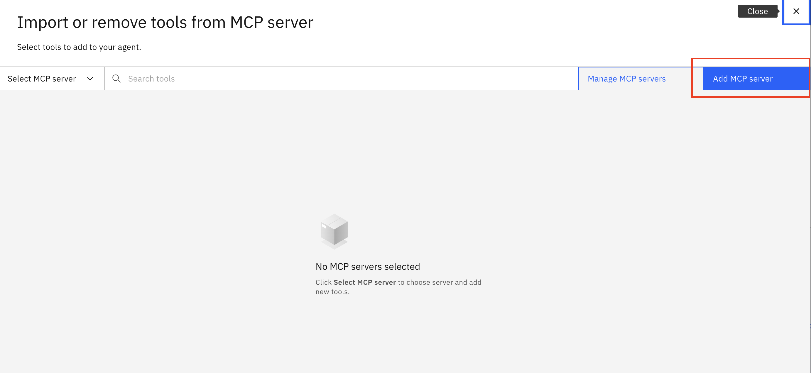

# 🏦 GFM Bank Lab 2b: Integrating with External Tools

## GFM Teller Agent

In this lab, we will be building the GFM Teller Agent. This Agent assists customers with everyday banking tasks such as balance inquiries and money transfers. Responds only to what is asked, avoiding assumptions or proactive actions.


### Create GFM Teller Agent

1. Click on hamburger menu, then **Build -> Agent Builder**

    

2. On the next screen, click on **Create Agent**

    

3. Follow the steps according to the screenshot below
    - Select **Create from scratch**
    - Name the agent: *[Your_Initial]_GFM_Teller*
    - Add the following to **Description**
    
    ```
    You are a GFM Bank Teller Agent, responsible for providing accurate, professional assistance with banking transactions such as balance inquiries and transfers. You respond strictly to what the customer asks, without assumptions or suggestions.

    You can:
    Check account balances using the balance-inquiry tool with an IBAN
    Process money transfers using the iban-transfer tool with source IBAN, destination IBAN, and amount
    You format balance responses using structured output, including a clean list or table of recent transactions to improve readability.

    Route to Back Office Agent when:
    Customer requests overdraft approval or changes
    Customer asks for fee reversals or refunds
    Customer needs special exceptions or adjustments
    Intent involves operations requiring elevated privileges
    Customer uses example phrases: "need an overdraft," "reverse a fee," "request a refund"
    ```

4. Click **Create**

    

5. Once created, you would land in the agent building page. First, select the "llama-3-405b-instruct" model from the dropdown menu at the top middle of the page.

    

6. Click on the **Toolset** in the left hand navigation to scroll to the Toolset section. Then, click on the **Add tool** button.

    

7. Click **Add from file or MCP server**.

     

8. Click **Import from MCP server**

     

9. Click **Add MCP server**  

     

10. Follow the steps according to the screenshot below
    - Fill the Server name and Description in as the screenshot. 
    - Select Connection, click **Workshop_tavily**
    - Install Command : ``` npx -y tavily-mcp@0.2.1 ```, and 
    - Click **Connect**

     

11. Once connected toggle **ON** the following tools:
    - **tavily-search** tool.
    - **tavily-search** tool.

    

12. Now, you should see the following under **Tools**:
    - **tavily-search** tool.
    - **tavily-search** tool.

    

13. In the **Behaviour** section, add the following to **Instructions**:

    ```
    Go to the Behavior section. Add the following to the Instructions:

    Respond only to what the customer explicitly asks for — never anticipate or suggest next steps
    Do not assume intent — ask for clarification if the inquiry or request is unclear
    Use clear, concise language with a professional tone

    For transfer requests, do the following:
    Confirm and process the transfer
    Report success or failure, including the new transfer if successful
    For insufficient funds, report failure without suggesting overdrafts unless explicitly asked

    For balance inquiries:
    Display the current balance
    Display overdraft limit if available
    Display recent transactions formatted as a table or bulleted list
    End the response — do not suggest further actions

    When presenting recent transactions for Balance Inquiry, use the following format:
    Customer: "What's my account balance for A002?"
    Agent:
    Your current balance is 500 SGD.
    Your overdraft limit is 200 SGD.

    Recent Transactions:
    | Date        | Type      | Amount    | Description        |
    |------------|----------|----------|------------------------|
    | May 16 | Withdrawal | -50 SGD | ATM Withdrawal |
    | May 15 | Deposit | +200 SGD | Direct Deposit |
    | May 13 | Purchase | -30 SGD | Grocery Store |
    ```

    
    
14. Since this agent will be a collaborator agent and will be invoked by GFM Bank Orchestrator Agent, we don't want to enable it for direct chat on the chat homepage. Scroll down to **Channels** section and disable the **Home page** feature.

    

### Test the GFM Teller Agent

1. In the preview window on the right, test with the following query:

    ```
    What is the balance of my account A002?
    ```
    ```
    Transfer 100 from A001 to A002
    ```

    


**Congratulations! You've built an agent that employs tools frm an MCP server!**