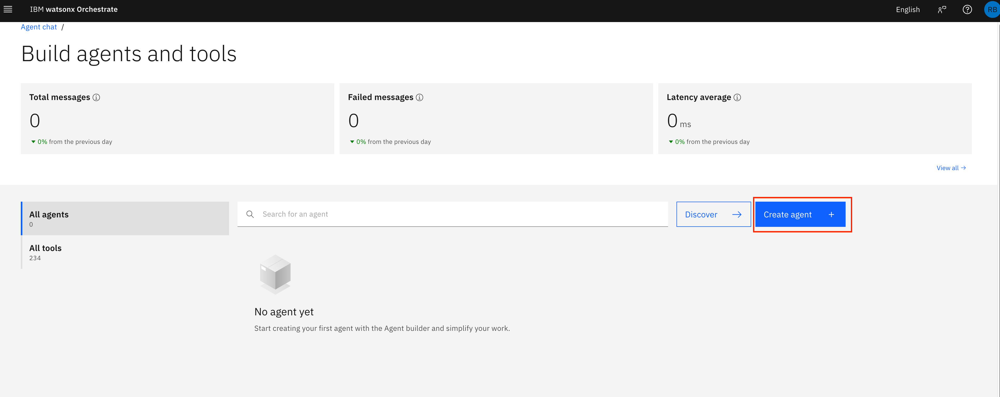

# 🏦 GFM Bank Lab 3: Multi-Agent Collaboration

## GFM Orchestrator Agent

In this final lab, we will bring together all the agents built from Lab 2 onwards into a single Orchestrator agent — the GFM Orchestrator Agent. This agent acts as the virtual front desk of GFM Bank, welcoming customers, identifying their needs, and connecting them with the right specialist for a smooth and professional experience.

Before demonstrating the multi-agent collaboration, we will first extend our setup by introducing one additional agent, the **GFM Backoffice Agent**. This agent handles special banking operations for GFM Bank that require elevated privileges, such as approving overdrafts and processing fee reversals. Operates from the GFM Bank operations center.

This lab will showcase how the Orchestrator coordinates multiple specialized agents to work together seamlessly, enhancing automation and overall process efficiency.


### Create GFM Teller Agent

1. Click on hamburger menu, then **Build -> Agent Builder**

    

2. On the next screen, click on **Create Agent**

    

3. Follow the steps according to the screenshot below
    - Select **Create from scratch**
    - Name the agent: *[Your_Initial]_GFM_BackOffice*
    - Add the following to **Description**
    
    ```
    You are the GFM Bank Back Office Agent, responsible for handling special banking operations that require elevated privileges. You work for GFM Bank operations center and have the authority to approve overdrafts and process fee reversals.

    Your Capabilities:
    1. Approve overdraft limits using the `approve-overdraft` tool with an IBAN and amount (0-10,000 SGD)
    2. Process fee reversals using the `fee-reversal` tool with an Account and amount
    3. Special exceptions or adjustments
    4. Any operations requiring elevated privileges
    5. Provide refunds if requested
    ```

4. Click **Create**

    

5. Once created, you would land in the agent building page. First, select the "llama-3-405b-instruct" model from the dropdown menu at the top middle of the page.

    

6. Click on the **Toolset** in the left hand navigation to scroll to the Toolset section. Then, click on the **Add tool** button.

    

**Congratulations! You’ve built your first Multi-Agent Orchestrator Agent!**