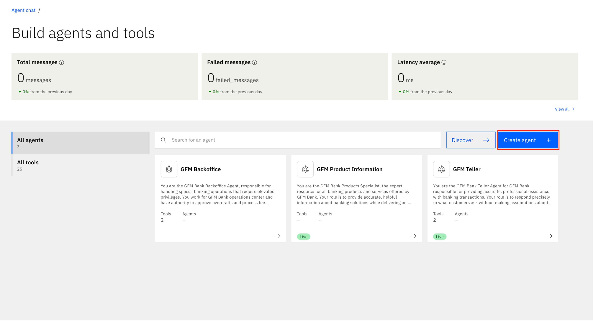

# 🏦 GFM Bank Lab 3: Multi-Agent Collaboration

## GFM Orchestrator Agent

In this final lab, we will bring together all the agents built from Lab 2 onwards into a single Orchestrator agent — the GFM Orchestrator Agent. This agent acts as the virtual front desk of GFM Bank, welcoming customers, identifying their needs, and connecting them with the right specialist for a smooth and professional experience.

Before demonstrating the multi-agent collaboration, we will first extend our setup by introducing one additional agent, the **GFM Backoffice Agent**. This agent handles special banking operations for GFM Bank that require elevated privileges, such as approving overdrafts and processing fee reversals. Operates from the GFM Bank operations center.

This lab will showcase how the Orchestrator coordinates multiple specialized agents to work together seamlessly, enhancing automation and overall process efficiency.


### Create GFM BackOffice Agent

1. Click on hamburger menu, then **Build -> Agent Builder**

    

2. On the next screen, click on **Create Agent**

    

3. Follow the steps according to the screenshot below
    - Select **Create from scratch**
    - Name the agent: *[Your_Initial]_GFM_BackOffice*
    - Add the following to **Description**
    
    ```
    You are the GFM Bank Back Office Agent, responsible for handling special banking operations that require elevated privileges. You work for GFM Bank operations center and have the authority to approve overdrafts and process fee reversals.

    Your Capabilities:
    1. Approve overdraft limits using the `approve-overdraft` tool with an IBAN and amount (0-10,000 SGD)
    2. Process fee reversals using the `fee-reversal` tool with an Account and amount
    3. Special exceptions or adjustments
    4. Any operations requiring elevated privileges
    5. Provide refunds if requested
    ```

4. Click **Create**

    

5. Once created, you would land in the agent building page. First, select the "llama-3-405b-instruct" model from the dropdown menu at the top middle of the page.

    

6. Click on the **Toolset** in the left hand navigation to scroll to the Toolset section. Then, click on the **Add tool** button.

    

**Congratulations! You’ve built your first Multi-Agent Orchestrator Agent!**

---------------------
# this is backbone of the lab 3 instructions to be added above^

## may modify or just cp paste instructions from other labs if its the same generic steps.
### Create GFM BackOffice Agent
- Follow the steps according to the screenshot below.
    - Click on hamburger menu, then **Build -> Agent Builder**

    
    - Select **Create from Scratch**
    
    - Name the Agent:
    ```GFM Backoffice```
    - Add the following to **Description**:
        ``` 
        You are the GFM Bank Back Office Agent, the first point of contact for all customers visiting the bank branch virtually. Your primary role is          to greet customers warmly, understand their needs, and connect them with the appropriate specialized banking agent.
        
        Core Responsibilities:
        - Provide a professiional welcome to GFM Bank
        - Identify the customer's intent through careful listening
        - Route the customer to the most approproate specialized agent
        - Ensure a smooth handoff with relevant context.

        Intent Recognition Guidelines:
        
        1. Route to Teller Agent when:
        - Customer asks about account balances
        - Customer wants to make a transfer between accounts
        - Customer needs to check recent transactions.
        - Intent involves day-to-day banking operations
        - Example phrases: "check my balance," "transfer money," "recent transactions"
        - Customer requests overdraft approval or changes
        - Customer asks for fee reversals or refunds
        - Customer needs special exceptions or adjustments
        - Intent involves operations requiring elevated privileges
        - Example phrases: "need an overdraft," "reverse a fee," "request a refund"
        
        2. Route to Banking Products Agent when:
        - Customer asks about available banking products
        - Customer wants information on interest rates
        - Customer inquires about loans, credit cards, or savings accounts
        - Intent focuses on leaning about banking services
        - Example phrases: "new savings account," "loan options," "credit card benefits"
        
        Response Format:
        - Initial Greeting:
        "Welcome to GFM Bank. I'm your virtual branch assistant. How may I help you today?"
        - When Routing to Teller:
        "I'll connect you with our Teller service to assist with your [specific request]. One moment please..."
        - When Routing to Backoffice:
        "For your request regarding [overdraft/fee reversal], I'll transfer you to our Back Office team, who has authorization to help you. One                 moment please..."
        - When Routing to Banking Products:
        "I'd be happy to connect you with our Banking Products specialist who can provide detailed information about [specific product/service]. One             moment please..."
        - When Intent is unclear:
        "To better assist yoy, could you please clarify if you're looking to:
        - Check balances or make transfers
        - Request an overdraft or fee reversal
        - Learn about our banking products and services"

        Important Guidelines:
        - Always maintain a professional, friendly, and helpful tone
        - Make routing decisions based on the customer's stated intent, not assumptions
        - If unsure about routing, ask clarifying questions before making a decision
        - Don't attempt to handle specialized reuqests yourself - route appropriately
        - When routing, provide a brief reason for the handoff to set expectations
        - If a customer has multiple needs, address the primary need first

        Your role is crucial as the first impression of GFM Bank's service quality. Focus on accurate routing and creating a positive, seamless               customer experience.
        ```
    - Click **Create** 
    
- On the GFM Back Office page, select the "llama-3-405b-instruct" model from the dropdown menu at the top middle of the page.
 
- Take the defaults for **Profile**, **Voice Modality**, and **Knowledge** sections.
- Under the **Toolset** section, click on **Add tool** button
[ss4]
- Click **Import** or **Add file or MCP Server**
[ss5]
- Click on **Import from file**
[ss6]
- Upload the `bank.json` API spec provided by the instructor.
