# 🧾 Sales Agent: Automate sales oriented tasks with Agentic AI. (Lab 1: Building a simple multi tool agent)

## Use Case Description

This use case targets developing and deploying an Sales agent leveraging IBM watsonx Orchestrate. This agent will empower employees to interact with sales systems and access information efficiently through conversational AI.

In lab 1a, we will build a very simple Sales agent in watsonx Orchestrate, provide it with tools to list items, list contacts, list tax rates and create quote.

## Step by step instructions to build the Sales Agent:

1. When you launch watsonx Orchestrate, you'll be directed to this page. Click on the hamburger menu in the top left corner:
   
2. Click on the down arrow next to **Build**. Then click on **Agent Builder**:
   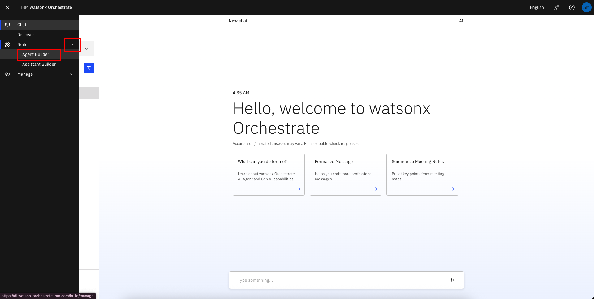
3. Click on **Create agent**:
   
4. Select "Create from scratch", give your agent a unique name (make sure to identify yourself by your initials or name, since this is a shared instance), e.g. "[Your Initial]\_Sales_Agent", and fill in the description as shown below:

```
This agent provides sales support for products. It also integrates with multiple tools like Xero to check prices, generate customer quotes with discounts, and review past quotes for specific clients. There is a also a knowledge resource on product catalog.
```

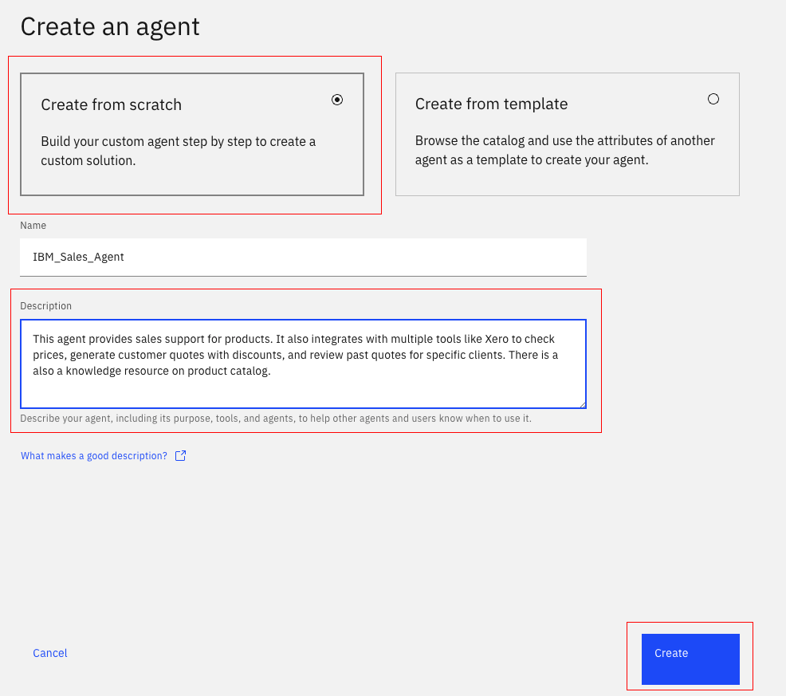
5. Scroll to the **Toolset** section. Click on **Add tool**:
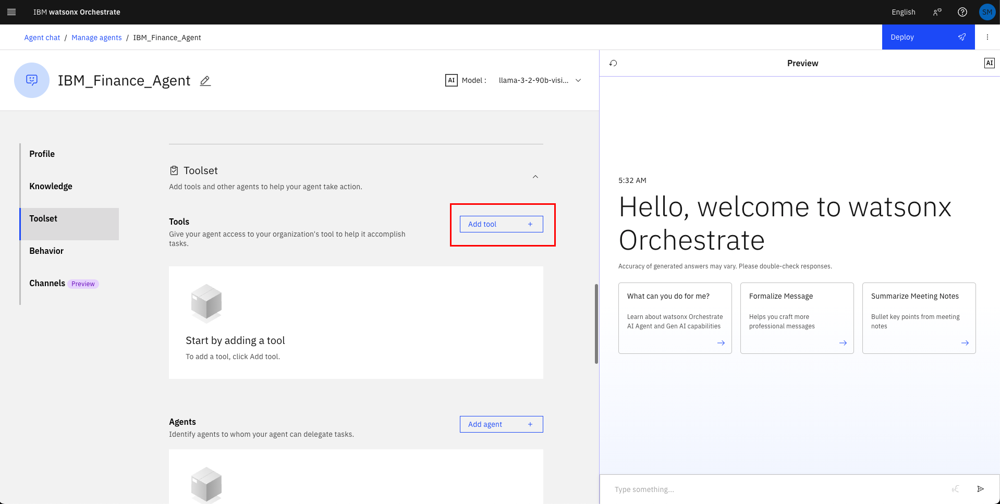
6. Click on the **Add from local instance**:
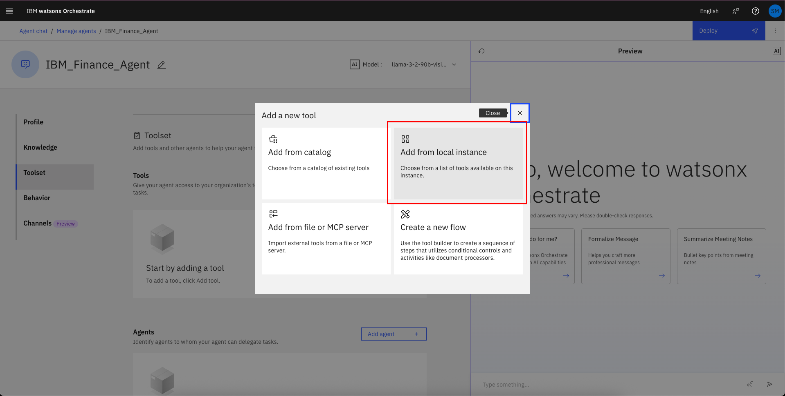
7. Search for "sa-xero-mcp:list-items" and select the tool by checking the box:
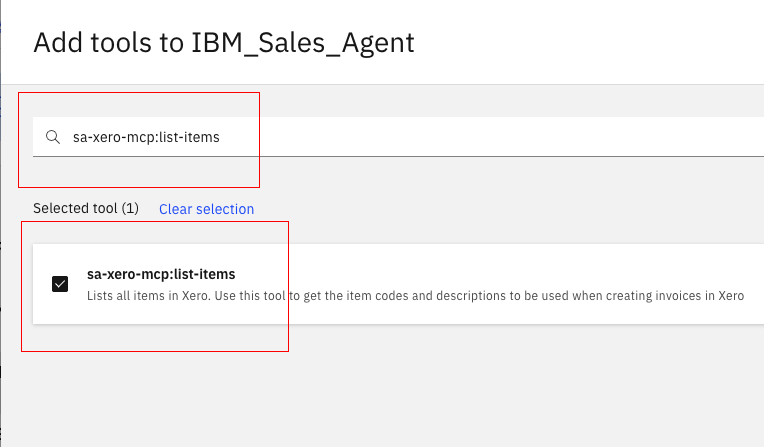
8. Search for "sa-xero-mcp:list-contacts" and select the tool by checking the box:
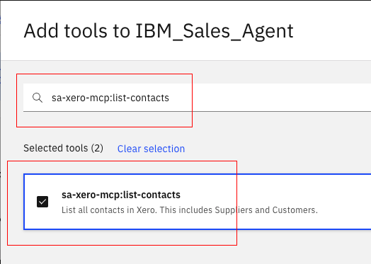
9. Search for "sa-xero-mcp:list-tax-rates" and select the tool by checking the box:
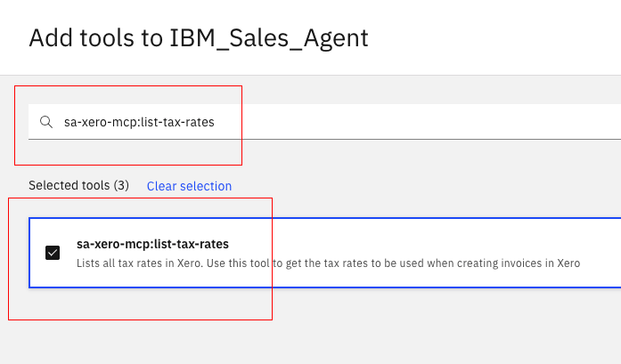
10. Search for "sa-xero-mcp:create-quote" and select the tool by checking the box. Then click on **Add to agent**:
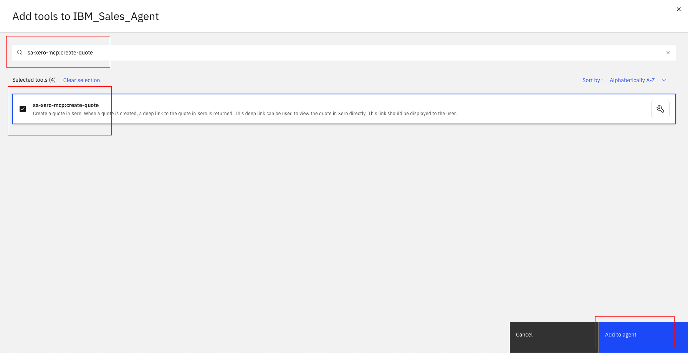
11. Wait until the tools has been added successfully and double check that it is now shown in the **Toolset** section:
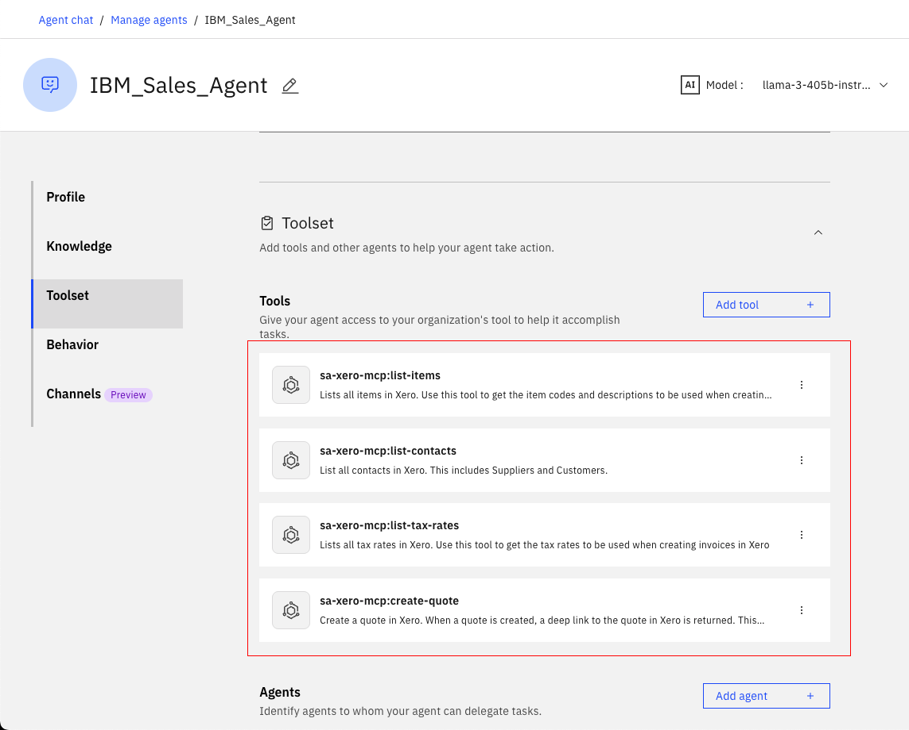
12. Scroll down to the **Behavior** section. Insert the instructions below into the **Instructions** field:

```
When user asks for product warranty, fetch warranty details from the catalog. For specification comparisons, retrieve specs for both products and present them side by side. For extreme temperature requests, return only routers with suitable operating ranges from the catalog.

When generating a quote, first call the create-quote tool with the information provided by the user. If the tool fails because required fields are missing or invalid, identify which fields are missing or incorrectly typed. For product details such as description, sales price, or account code, call list-items and extract those values. Map the sales price field (often called unitPrice) from list-items into the unitAmount field required by create-quote. For the customer identifier, call list-contacts and resolve the contactId. For tax, call list-tax-rates and use a valid tax type. If quantity is missing, re-read the user prompt; if it is not provided, ask the user once for it. Before retrying create-quote, ensure that all numeric fields such as unitAmount and quantity are passed as numbers, not strings, and that all required fields (description, unitAmount, accountCode, taxType, quantity, contactId) are included. Then retry create-quote with the fully populated payload and return the actual result with customer, quote ID, line items, subtotal, taxes, total, and view link. If a required value cannot be found, report it clearly and stop instead of simulating the quote.

When asked about quotes for a customer in the past 30 days, get the customer ID, retrieve all relevant quotes, and return them in a formatted list with IDs, dates, statuses, totals, and links. Past quotes are those with Type = QUOTE and Status = SENT or ACCEPTED.
```

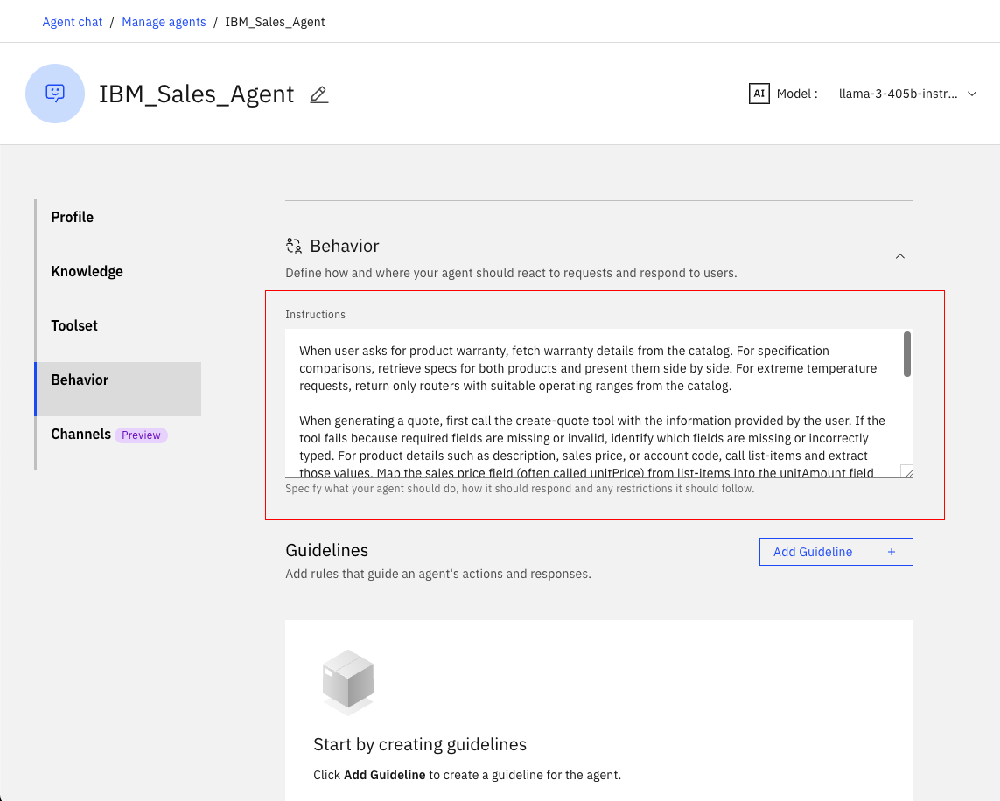
13. Test your agent in the preview chat on the right side by asking the following questions and validating the responses. They should look similar to what is shown in the screenshot(s) below:

```
What's the warranty on NR3000?
```

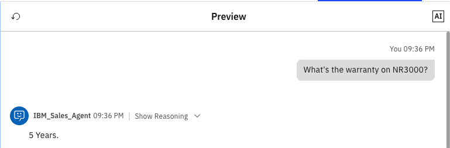

```
Which has higher switching capacity: AX9000 or SX500?
```

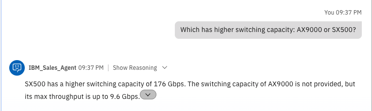
```
Which router works in extreme temperatures?
```

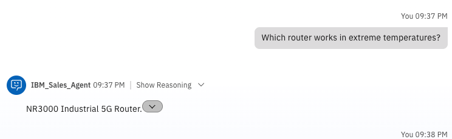

```
Generate a quote for 20 NR3000 routers for SMART Agency with a 10% discount.
```

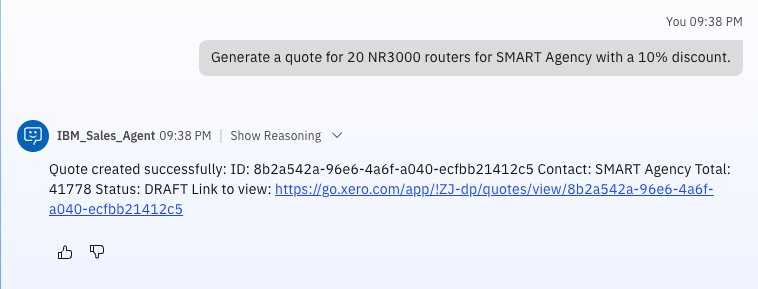
