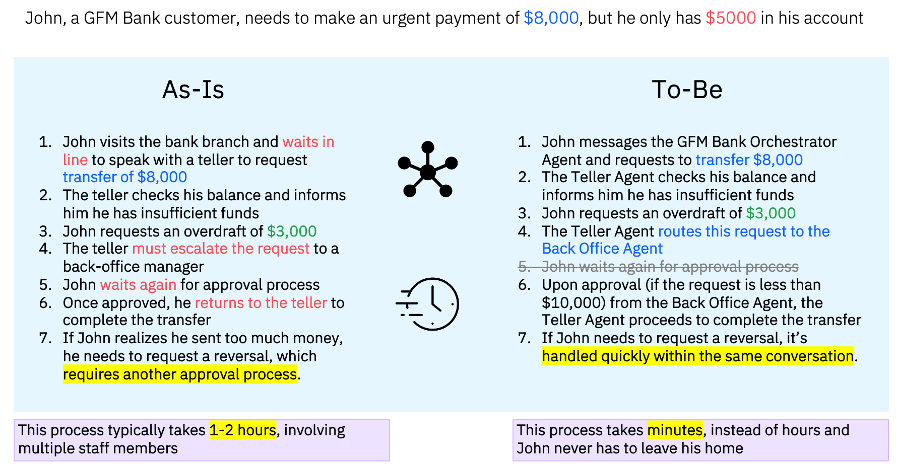
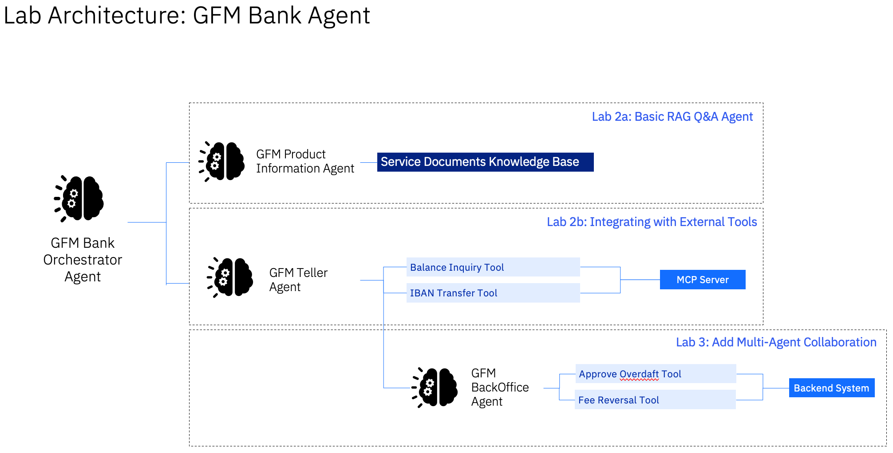

# Getting Started
1. These labs are for lab participants of IBM Agentic AI Incubation Workshop.
1. Ensure you have an IBM ID and access to a watsonx orchesetrate environment provided by the instructor.
1. Follow the instructions in Labs 1, 2 and 3.

# Lab 1 Scenario: Discover prebuilt IT tools in Watsonx Orchestrate
The **IBM watsonx Orchestrate catalog** serves as a vast repository of prebuilt AI agents and tools, tailored to address a wide array of use cases and requirements. This extensive collection helps you discover agents, tools, or a blend of both that align with your specific needs. In this lab, we will use one of the prebuilt tools in the IT domain to demonstrate how easy it is for a user to start the agent-building journey.

### Lab Architecture

# Lab 2 and 3 Scenario: Transforming Banking with Intelligent Agents
### 🔍 Introduction

In this hands-on workshop, you'll transform a traditional banking application into a modern, AI-powered solution using **watsonx Orchestrate**. The banking industry is undergoing rapid digital transformation, and GFM Bank is leading the way by implementing innovative AI agents to handle customer interactions.

GFM Bank faces challenges with traditional teller and back-office operations that are manual, time-consuming, and often result in long customer wait times. By implementing an Agentic AI solution, the bank aims to:
- Provide 24/7 customer support for common banking operations
- Reduce wait times for transactions and approvals
- Maintain strict compliance through faster service
- Free up human staff to handle more complex customer needs

In this lab, you'll build a system of collaborating AI agents that can handle banking operations including:
- Account balance inquiries
- Money transfers between accounts
- Overdraft limit approvals
- Fee reversals
- Product information requests

### 📊 Banking Operations
Currently, GFM Bank relies on human tellers for basic transactions and back-office staff for approvals, leading to delays and inconsistent customer experiences in peak season.

### Lab Architecture
We will be building an GFM Bank Agent that allows the GFM Bank Customers to perform common banking operations with ease.

